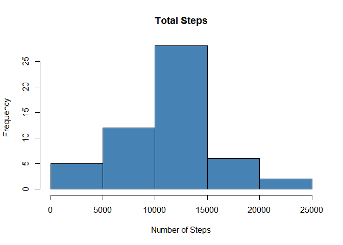

# Reproducible Research: Peer Assessment 1


## Loading and preprocessing the data


```r
# setwd("C:/Jomit/github/RepData_PeerAssessment1")
activityData = read.csv('activity.csv')
```


## What is mean total number of steps taken per day?  

###Histogram of the total number of steps taken per day 


```r
totalstepsperday = aggregate(activityData$steps ~ activityData$date, activityData,sum,na.action=na.omit)
colnames(totalstepsperday) = c("Day","TotalSteps")
totalstepsperday$Day = as.Date(totalstepsperday$Day,"%Y-%m-%d")
hist(totalstepsperday$TotalSteps,main="Total Steps", xlab="Number of Steps", col="steelblue")
```

 

###Mean and Median of the total number of steps taken per day  


```r
mean(totalstepsperday$TotalSteps)
```

```
## [1] 10766.19
```

```r
median(totalstepsperday$TotalSteps)
```

```
## [1] 10765
```

## What is the average daily activity pattern?  

###Time series plot of interval and average number of steps.  


```r
averagestepsbyminute = aggregate(activityData$steps ~ activityData$interval, activityData,mean)
colnames(averagestepsbyminute) = c("Minute","AverageSteps")
plot(averagestepsbyminute$Minute, averagestepsbyminute$AverageSteps, 
     col="steelblue", main="Average daily activity pattern", 
     xlab="5-minute interval",ylab="Average steps across all days", 
     type="l")
```

 

###5-minute interval that contains the maximum number of steps:  


```r
averagestepsbyminute[which.max(averagestepsbyminute$AverageSteps),]
```

```
##     Minute AverageSteps
## 104    835     206.1698
```

## Imputing missing values

###Total number of rows with missing values in the activity dataset  


```r
length(which(is.na(activityData)))
```

```
## [1] 2304
```

###Creating new dataset with missing values filled in with mean of that minute of the day.


```r
library("plyr")
```

```
## Warning: package 'plyr' was built under R version 3.1.3
```

```r
library("Hmisc")
```

```
## Warning: package 'Hmisc' was built under R version 3.1.3
```

```
## Loading required package: grid
## Loading required package: lattice
```

```
## Warning: package 'lattice' was built under R version 3.1.3
```

```
## Loading required package: survival
```

```
## Warning: package 'survival' was built under R version 3.1.3
```

```
## Loading required package: Formula
```

```
## Warning: package 'Formula' was built under R version 3.1.3
```

```
## Loading required package: ggplot2
```

```
## Warning: package 'ggplot2' was built under R version 3.1.3
```

```
## 
## Attaching package: 'Hmisc'
## 
## The following objects are masked from 'package:plyr':
## 
##     is.discrete, summarize
## 
## The following objects are masked from 'package:base':
## 
##     format.pval, round.POSIXt, trunc.POSIXt, units
```

```r
newActivityData <- ddply(activityData, "interval", mutate, steps = impute(steps, mean))
```

###Histogram of the total number of steps taken per day on after filling in missing values


```r
totalstepsperday.new = aggregate(newActivityData$steps ~ newActivityData$date, newActivityData,sum,na.action=na.omit)
colnames(totalstepsperday.new) = c("Day","TotalSteps")
totalstepsperday.new$Day = as.Date(totalstepsperday.new$Day,"%Y-%m-%d")
hist(totalstepsperday.new$TotalSteps,main="Total Steps", xlab="Number of Steps", col="steelblue")
```

 

###Mean and Median of the total number of steps taken per day after filling in missing values


```r
mean(totalstepsperday.new$TotalSteps)
```

```
## [1] 10766.19
```

```r
median(totalstepsperday.new$TotalSteps)
```

```
## [1] 10766.19
```

###Impact of imputing missing values  


```r
par(mfrow=c(2,1))
hist(totalstepsperday$TotalSteps,main="Total Steps for each Day before filling missing value", xlab="Number of Steps", col="steelblue", labels=TRUE, ylim=c(0,50))

hist(totalstepsperday.new$TotalSteps,main="Total Steps for each Day after filling missing values", xlab="Number of Steps", col="steelblue", labels=TRUE, , ylim=c(0,50))
```

 


## Are there differences in activity patterns between weekdays and weekends?  

###Create weekday, weekend factor variable

```r
library("timeDate")
```

```
## Warning: package 'timeDate' was built under R version 3.1.3
```

```r
newActivityData$DayType = ifelse(isWeekday(newActivityData$date), "weekday","weekend")
```


### Time series...  


```r
tmp = aggregate(steps~interval+DayType,newActivityData,mean)
library(lattice)
xyplot(steps ~ interval|DayType, data=tmp,layout=c(1,2), type="l", 
       xlab="Interval", ylab="Number of steps")
```

 

